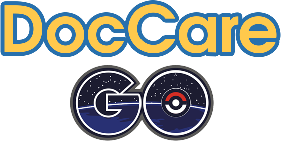

# DocCare Go

<center></center>

> Term Project รายวิชา Software Engineering คณะวิศวกรรมศาสตร์ ภาควิชาวิศวกรรมคอมพิวเตอร์ จุฬาลงกรณ์มหาวิทยาลัย ปีการศึกษา 2559 พัฒนาโดยกลุ่ม Hospital Again? โดยใช้ชุด MEAN Stack ในการพัฒนา

DocCare Go เป็นระบบจัดการการนัดหมายของผู้ป่วยนอก (OPD - Out Patient Department)

# Project Tools
- **Angular 2** สำหรับ Front-End framework เขียนโดยภาษา TypeScript
- **NodeJS** สำหรับ Server-Side ที่เขียนโดยภาษา JavaScript
- **ExpressJS** Framework ของ NodeJS ในการทำ API Back-End
- **MongoDB** สำหรับระบบจัดการฐานข้อมูล ใช้งานควบคู่กับ Mongoose ที่ทำให้จัดทำระบบฐานข้อมูลในลักษณะ Model-Base
- **Bulma** สำหรับ CSS Framework โดย base บน flexbox
- **Font-Awesome** สำหรับ icon
- **Webpack** สำหรับการทำ Module Bundler
- **JSON Web Token (JWT)** สำหรับการทำ Authorization

# Project Setup
- Clone โปรเจค
- ติดตั้ง Library ที่ต้องใช้ โดยคำสั่ง `npm install`
- สั่ง `gulp dev` เพื่อสั่งเปิด Web Server และรัน Web Apps

# Project Seeder API
- POST /seed/default/data
- POST /seed/default/user
- POST /seed/admin

# For Front-End Developer
ในช่วงของการ Development นั้น หากพัฒนาในส่วนของ Front-End ต้องสั่ง

```
webpack --progress --watch
```

เพื่อให้ Webpack ทำงาน โดย Webpack จะทำการ transpile TypeScript ของ Angular 2 ไปเป็น JavaScript, Load CSS และ LESS แล้วทำการ Bundle เป็นไฟล์เดียวกัน โดยจะแยกออกเป็น 3 ไฟล์ `main.bundle.js`, `polyfills.bundle.js`, `vendor.module.js` อยู่ในโฟลเดอร์ `web/dist/`

